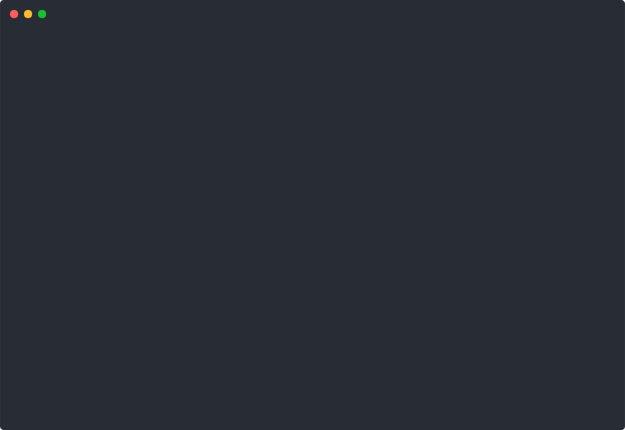

<h1 align="center">Atlas</h1>

<p align="center">
  Open-source text-to-SQL agent you can embed anywhere.
</p>

<p align="center">
  <a href="https://github.com/AtlasDevHQ/atlas/actions/workflows/ci.yml"></a>
  <a href="https://www.npmjs.com/package/@useatlas/sdk"></a>
  <a href="https://github.com/AtlasDevHQ/atlas/blob/main/LICENSE"></a>
</p>

<p align="center">
  <a href="https://docs.useatlas.dev">Documentation</a> · <a href="https://app.useatlas.dev">Live Demo</a> · <a href="https://docs.useatlas.dev/docs/deployment/deploy">Deploy Guide</a> · <a href="https://github.com/AtlasDevHQ/atlas/issues">Issues</a>
</p>

<p align="center">
  
</p>

---

## What is Atlas?

Atlas is a deploy-anywhere text-to-SQL agent. Connect any database, auto-generate a semantic layer, and let your users ask questions in plain English. Every query is validated through a multi-layer security pipeline — only read-only SQL against whitelisted tables is allowed.

Built with Hono, Vercel AI SDK, and bun. Supports Anthropic, OpenAI, Bedrock, Ollama, and Vercel AI Gateway. Works with PostgreSQL, MySQL, ClickHouse, Snowflake, DuckDB, BigQuery, and Salesforce.

## Try it in 60 seconds

```bash
bun create atlas-agent my-app --demo
cd my-app && bun run dev
# Open http://localhost:3000
```

The `--demo` flag seeds a cybersecurity SaaS database with ~200K rows so you can start asking questions immediately.

## Embed in your app

Drop a single `<script>` tag into any page to add a floating chat widget:

```html
<script
  src="https://your-atlas.example.com/widget.js"
  data-api-url="https://your-atlas.example.com"
  data-theme="dark"
></script>
```

Or use the React component:

```tsx
import { AtlasChat } from "@useatlas/react";

export default function App() {
  return <AtlasChat apiUrl="https://your-atlas.example.com" />;
}
```

The widget supports programmatic control (`Atlas.open()`, `Atlas.ask("...")`, `Atlas.destroy()`), event callbacks, and theming. See the [widget docs](https://docs.useatlas.dev/docs/frameworks/widget).

## Why Atlas?

| | Atlas | Traditional BI | Other text-to-SQL |
|---|---|---|---|
| **Embeddable** | Script tag, React component, or headless API | Standalone app | Standalone app |
| **Deploy anywhere** | Docker, Railway, Vercel, or your own infra | Vendor-hosted | Vendor-hosted |
| **Semantic layer** | YAML on disk, version-controlled, LLM-enriched | Proprietary metadata | None or limited |
| **Plugin ecosystem** | 16 plugins across 5 types — extend anything | Closed | Limited |
| **Open source** | MIT license, full codebase | Proprietary | Varies |
| **Multi-database** | PostgreSQL, MySQL, ClickHouse, Snowflake, DuckDB, BigQuery, Salesforce | Usually one | Usually one |

## Deploy

[](https://vercel.com/new/clone?repository-url=https%3A%2F%2Fgithub.com%2FAtlasDevHQ%2Fatlas-starter-vercel&project-name=atlas&repository-name=atlas&products=%5B%7B%22type%22%3A%22integration%22%2C%22integrationSlug%22%3A%22neon%22%2C%22productSlug%22%3A%22neon%22%2C%22protocol%22%3A%22storage%22%7D%5D&env=AI_GATEWAY_API_KEY,BETTER_AUTH_SECRET&envDescription=AI_GATEWAY_API_KEY%3A%20Vercel%20AI%20Gateway%20key%20(vercel.com%2F~%2Fai%2Fapi-keys).%20BETTER_AUTH_SECRET%3A%20Random%20string%2C%2032%2B%20chars%20(openssl%20rand%20-base64%2032).)
[](https://railway.com/deploy/_XHuNP?referralCode=N5vD3S)

**Docker:**

```bash
git clone https://github.com/AtlasDevHQ/atlas-starter-docker.git && cd atlas-starter-docker
cp .env.example .env   # Set your API key + database URL
docker compose up
```

| Platform | Starter | Guide |
|----------|---------|-------|
| Vercel | [atlas-starter-vercel](https://github.com/AtlasDevHQ/atlas-starter-vercel) | Next.js + embedded Hono API + Neon Postgres |
| Railway | [atlas-starter-railway](https://github.com/AtlasDevHQ/atlas-starter-railway) | Docker + sidecar sandbox + Railway Postgres |
| Docker | [atlas-starter-docker](https://github.com/AtlasDevHQ/atlas-starter-docker) | Docker Compose + optional nsjail isolation |

## How It Works

1. User asks a natural language question
2. Agent explores the **semantic layer** (YAML files describing your schema)
3. Agent writes SQL, validated through a multi-layer security pipeline (regex guard, AST parse, table whitelist, auto-LIMIT, statement timeout)
4. Results are returned with charts and interpreted narrative

```
User question → Semantic layer exploration → SQL generation → Multi-layer validation → Query execution → Charts + narrative
```

### Generate the semantic layer

```bash
bun run atlas -- init                 # Profile DB and generate YAMLs
bun run atlas -- init --enrich        # Profile + LLM enrichment
bun run atlas -- init --demo          # Load demo data + profile
```

## Architecture

```
atlas/
├── packages/
│   ├── api/              # @atlas/api — Hono API server + agent loop + tools + auth
│   ├── web/              # @atlas/web — Next.js frontend + chat UI components
│   ├── cli/              # @atlas/cli — CLI (profiler, schema diff, enrichment)
│   ├── mcp/              # @atlas/mcp — MCP server (Claude Desktop, Cursor, etc.)
│   ├── sdk/              # @useatlas/sdk — TypeScript SDK
│   ├── plugin-sdk/       # @useatlas/plugin-sdk — Plugin type definitions
│   └── sandbox-sidecar/  # @atlas/sandbox-sidecar — Isolated explore sidecar
├── plugins/              # 16 plugins (datasource, context, interaction, action, sandbox)
├── create-atlas/         # Scaffolding CLI (bun create atlas-agent)
├── apps/
│   ├── www/              # Landing page (useatlas.dev)
│   └── docs/             # Documentation (docs.useatlas.dev)
└── examples/             # Docker + Vercel deploy examples
```

## Security

SQL validation runs through multiple layers. Your database credentials and query results never leave your infrastructure — only questions reach the LLM provider (use Ollama for fully self-hosted).

| Layer | What it does |
|-------|-------------|
| Read-only enforcement | Only SELECT queries allowed (regex + AST validation) |
| AST parsing | `node-sql-parser` verifies single-statement SELECT |
| Table whitelist | Only tables in your semantic layer are queryable |
| Auto LIMIT | Every query gets a LIMIT (default 1000) |
| Statement timeout | Queries killed after 30s (configurable) |
| Sandboxed execution | Filesystem access runs in nsjail / Firecracker / sidecar |
| Row-level security | Optional RLS injection per-user |

See [sandbox architecture](https://docs.useatlas.dev/docs/architecture/sandbox) for the full threat model.

## Environment Variables

| Variable | Default | Description |
|----------|---------|-------------|
| `ATLAS_PROVIDER` | `anthropic` | LLM provider (`anthropic`, `openai`, `bedrock`, `ollama`, `gateway`) |
| `ATLAS_MODEL` | Provider default | Model ID override |
| `DATABASE_URL` | — | Atlas internal Postgres for auth, audit, settings |
| `ATLAS_DATASOURCE_URL` | — | Analytics datasource (PostgreSQL, MySQL, etc.) |
| `ATLAS_ROW_LIMIT` | `1000` | Max rows per query |
| `ATLAS_QUERY_TIMEOUT` | `30000` | Query timeout in ms |

See [`.env.example`](.env.example) for all options.

## Documentation

- [Quick Start](https://docs.useatlas.dev/docs/getting-started/quick-start) — Local dev from zero to asking questions
- [Deploy Options](https://docs.useatlas.dev/docs/deployment/deploy) — Docker, Railway, Vercel, and more
- [Connect Your Data](https://docs.useatlas.dev/docs/getting-started/connect-your-data) — Connect to an existing database safely
- [Widget Embedding](https://docs.useatlas.dev/docs/frameworks/widget) — Script tag and React component
- [Bring Your Own Frontend](https://docs.useatlas.dev/docs/frameworks/overview) — Nuxt, SvelteKit, React/Vite, TanStack Start
- [Plugin Authoring](https://docs.useatlas.dev/docs/plugins/authoring-guide) — Build custom plugins
- [Security & Sandbox](https://docs.useatlas.dev/docs/architecture/sandbox) — Threat model, isolation tiers

## Contributing

Quick development setup:

```bash
git clone https://github.com/AtlasDevHQ/atlas.git && cd atlas
bun install
bun run db:up         # Start Postgres + sandbox sidecar
cp .env.example .env  # Set ATLAS_PROVIDER + API key
bun run dev           # http://localhost:3000
```

## Acknowledgments

Atlas was inspired by [Abhi Sivasailam](https://x.com/_abhisivasailam)'s work on Vercel's internal data agent **d0** and the open-source [vercel-labs/oss-data-analyst](https://github.com/vercel-labs/oss-data-analyst) template. The core insight — invest in a rich semantic layer, trust the model, and keep the tool surface minimal — came from that work.

## License

MIT
