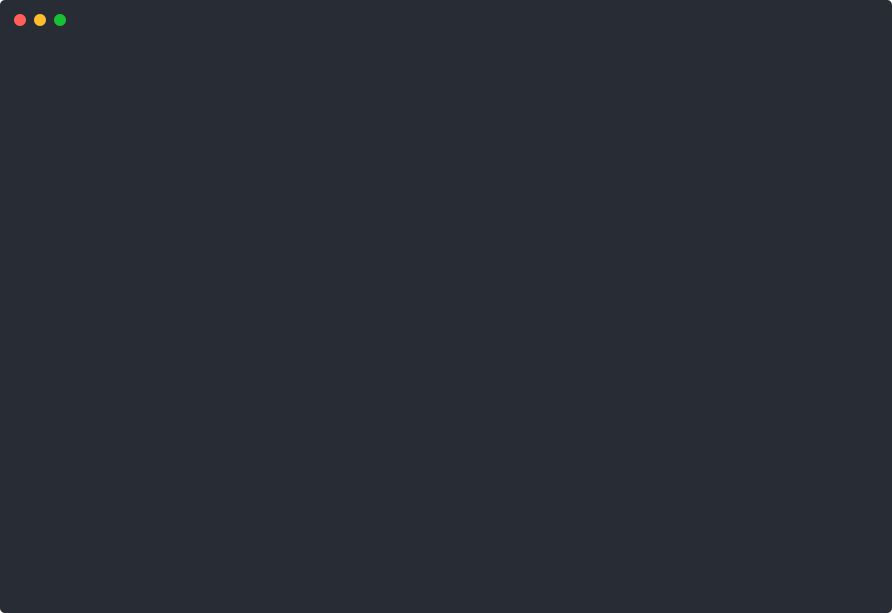

<h1 align="center">Atlas</h1>

<p align="center">
  <strong>Atlas is the company facts your AI agents can trust: every one carries its source, its date, and the name of the person who approved it. Open source, runs in your VPC.</strong>
</p>

<p align="center">
  <a href="https://github.com/AtlasDevHQ/atlas/actions/workflows/ci.yml"></a>
  <a href="https://www.npmjs.com/package/@useatlas/mcp"></a>
  <a href="https://github.com/AtlasDevHQ/atlas/blob/main/LICENSE"></a>
</p>

<p align="center">
  
</p>

One command, from a terminal, with no account and no email. It points Claude Desktop, Cursor or Continue at the hosted NovaMart demo:

```bash
bunx @useatlas/mcp init --hosted --demo --write
```

Restart the client and ask:

> **What is NovaMart's return window?**

The answer carries a name. Finance says 30 days — Priya Natarajan, Head of Finance, in `#finance`, on a date, a claim a person approved before it counted. Support's macro says 14. Atlas shows both and picks neither. Ask what the warehouse says and the live rows come back with the exact SQL that read them. (Claude Code, VS Code and other clients: the same command with `--client generic` prints a block to paste. On WSL2, write `bun x` instead of `bunx`.)

## How it works

Three kinds of thing live in the Atlas, and every answer says which it is drawing on:

1. **Surveyed** — read straight from your company's own data through a semantic layer you author. True by construction: the query re-reads live rows, nobody interpreted anything, and it cannot go stale between readings. SELECT-only, single statement, table-whitelisted, validated seven ways before it runs.
2. **Attested** — extracted from something someone wrote, then approved by a named person in your company. That person is on the record, and the fact carries its source and its date.
3. **On the record** — the raw source material itself, unedited. Trustworthy as testimony, not as fact.

Surveyed outranks Attested wherever they overlap, so a recollection never overwrites the data. Nothing becomes Attested without a person approving it, and there is no setting that turns that off. Contradictions are shown with both claims and both sources; Atlas does not pick a winner. Where nobody has surveyed, the coverage page says so instead of guessing.

## Run it

- **From your AI agent** — the command above against the demo; `bunx @useatlas/mcp init --hosted --write` against your own hosted workspace; `--local` against a self-hosted one. [MCP guide](https://docs.useatlas.dev/guides/mcp).
- **Hosted** — [app.useatlas.dev](https://app.useatlas.dev): connect your data, invite your team, two-week trial, no card. [Hosted quick start](https://docs.useatlas.dev/getting-started/hosted).
- **Self-hosted** — the complete Atlas under AGPL, in your VPC, free; Docker, Railway or Vercel. [Self-host quick start](https://docs.useatlas.dev/self-hosted/getting-started/quick-start).

## Where everything else went

This README used to inventory the whole product. Each section now lives on one docs page:

- The four context surfaces (semantic layer, Knowledge Base, learned patterns, the Company Atlas) and where answers show up — [Introduction](https://docs.useatlas.dev)
- The YAML semantic layer and a worked `orders.yml` — [Semantic layer](https://docs.useatlas.dev/getting-started/semantic-layer)
- The NovaMart dataset and the canonical questions — [Demo datasets](https://docs.useatlas.dev/getting-started/demo-datasets)
- The local scaffold (`bun create atlas-agent`) — [Self-host quick start](https://docs.useatlas.dev/self-hosted/getting-started/quick-start)
- The embeddable widget and React component — [Embedding widget](https://docs.useatlas.dev/guides/embedding-widget)
- How Atlas compares to Genie, Cortex Analyst, Hyper, Glean and the text-to-SQL peers — [Comparisons](https://docs.useatlas.dev/comparisons)
- Deploy buttons, starters and Docker Compose — [Deploy](https://docs.useatlas.dev/self-hosted/deployment/deploy)
- The SQL validation pipeline and sandbox threat model — [SQL validation](https://docs.useatlas.dev/security/sql-validation), [Sandbox architecture](https://docs.useatlas.dev/architecture/sandbox)
- Environment variables — [Reference](https://docs.useatlas.dev/reference/environment-variables) and [`.env.example`](.env.example)
- Plugins, datasources, chat platforms and connectors — [Plugin authoring](https://docs.useatlas.dev/plugins/authoring-guide), [Integrations](https://docs.useatlas.dev/guides/integrations)
- Supported databases and LLM providers — [Connect your data](https://docs.useatlas.dev/getting-started/connect-your-data), [Model routing](https://docs.useatlas.dev/guides/model-routing)
- The Knowledge Base, dashboards, and bringing your own frontend — [Knowledge Base](https://docs.useatlas.dev/guides/knowledge-base), [Dashboards](https://docs.useatlas.dev/guides/dashboards), [Frameworks](https://docs.useatlas.dev/self-hosted/frameworks/overview)
- The CLI (`atlas init`, `atlas diff`, and the rest) — [CLI reference](https://docs.useatlas.dev/reference/cli)
- The monorepo layout and dev setup — [CONTRIBUTING.md](CONTRIBUTING.md)
- What is open source and what is commercial — [Enterprise boundary](https://docs.useatlas.dev/architecture/enterprise)

## Acknowledgments

Atlas was inspired by [Abhi Sivasailam](https://x.com/_abhisivasailam)'s work on Vercel's internal data agent **d0** and the open-source [vercel-labs/oss-data-analyst](https://github.com/vercel-labs/oss-data-analyst) template. The core insight — invest in a rich semantic layer, trust the model, and keep the tool surface minimal — came from that work.

## License

The server and core packages are [AGPL-3.0](LICENSE): if you modify the server and serve it to users, you share those modifications. The client libraries (`@useatlas/sdk`, `@useatlas/react`, `@useatlas/types`, `@useatlas/plugin-sdk`, `@useatlas/mcp`) and all plugins are [MIT](packages/sdk/LICENSE). The `ee/` directory is source-available under a [commercial license](ee/LICENSE); nothing that makes the Atlas work is behind it — only governance, convenience and scale. Full inventory: [Enterprise boundary](https://docs.useatlas.dev/architecture/enterprise).
