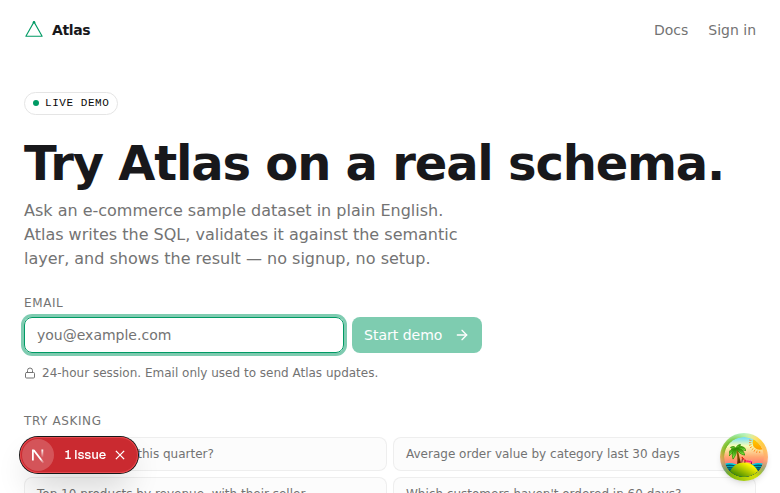
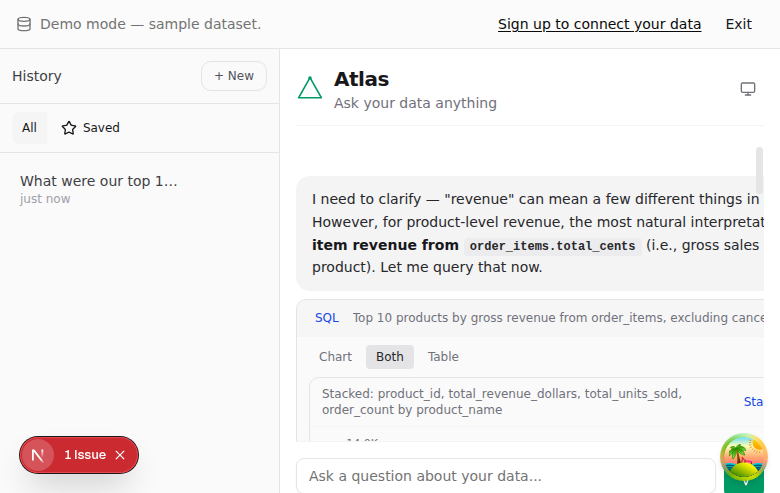
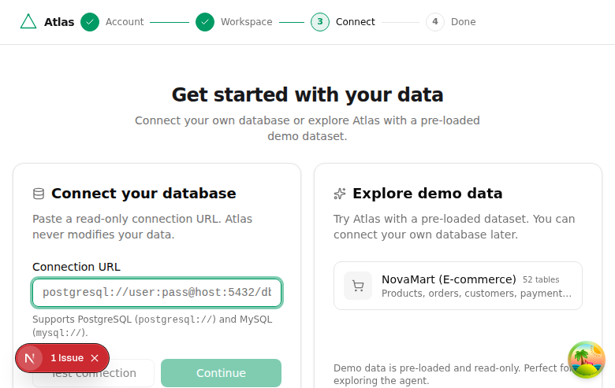
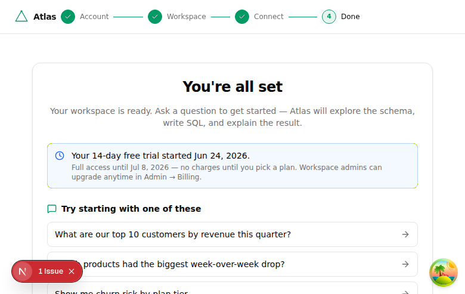

# Cold-Start Activation Audit (#3925)

A launch-readiness (#2919 / milestone #74) walkthrough of the **SaaS cold-start
activation funnel** — the path a brand-new visitor takes from landing to their
first useful answer. The conversion metric is **time-to-first-answer from a cold
click**: a visitor who hits a dead end, a confusing empty state, or an unclear
gate bounces.

This doc records the walkthrough, the friction found at each step, the safe
fixes applied in this PR, and the judgment-heavy findings flagged for human
review. It is a point-in-time audit — re-run the walkthrough before the v0.1.0
tag to confirm the flagged items are resolved.

## Method

- **Local SaaS dev** (`ATLAS_DEPLOY_MODE=saas` + `ATLAS_DEPLOY_ENV=development`,
  which relaxes the SaaS fail-closed boot guards) so the trial/signup funnel
  exists locally; the NovaMart demo dataset (52 tables) is the test datasource.
- **Playwright** drove a real browser through landing → demo → signup → connect
  → first answer, as a new user, capturing the rendered state and the browser
  console at each step.
- Screenshots in [`assets/cold-start-activation/`](./assets/cold-start-activation/).

## Funnel walkthrough

| Step | Surface | Status | Notes |
|------|---------|--------|-------|
| 1. Landing | `apps/www` hero → `app.useatlas.dev/demo` | ✅ clear | Primary CTA "Try the demo →" leads to the zero-signup demo. |
| 2. Demo gate | `/demo` (`packages/web/src/app/demo/page.tsx`) | ✅ polished | Clear headline, email-only gate, "24-hour session" note, sample prompts, NovaMart dataset card.  |
| 3. Demo first answer | `<AtlasChat>` | ✅ strong "aha" | Real answer: SQL (10 rows, 0.1s) → chart → formatted table → key observations → follow-up chips → CSV/Excel.  |
| 4a. Signup · account | `/signup` | ✅ polished | Progress indicator (Account → Workspace → Connect → Done), Terms/Privacy, social options. |
| 4b. Signup · workspace | `/signup/workspace` | ✅ clear | Explains what a workspace is; auto-slug; helper text. |
| 4c. Signup · region | `/signup/region` | ⚠️ dead-end on error | Auto-skips when no regions configured (200 `[]`); **traps the user when the regions API errors** (disabled Continue, only Back). |
| 4d. Signup · connect | `/signup/connect` | ✅ clear | "Connect your database" + "Explore demo data" + "Skip for now".  |
| 5. Success / trial | `/signup/success` | ✅ polished | Trial clearly communicated ("14-day free trial… no charges until you pick a plan"), starter prompts, secondary actions.  |
| 6. Authed first-run | `/` (`(workspace)/page.tsx`) | ⛔ **composer dead-end** | After connecting the demo dataset, the chat shows "Connect data to get started" and **hides the composer** — see flagged finding F1. |

The demo funnel reaches a real, high-quality first answer with zero signup. The
authed funnel is polished step-to-step but has one blocking dead-end (F1) at the
"aha" moment.

## Fixes applied in this PR (safe, conventional polish)

### 1. CSP nonce hydration error on every page

**Symptom:** every funnel page logged a React hydration error in the browser
console:

```
A tree hydrated but some attributes of the server rendered HTML didn't match…
  nonce="…" (server)  vs  nonce="" (client)
```

**Cause:** under a nonce-based CSP the browser strips the `nonce` content
attribute from the DOM once it authorizes the inline script, so the client reads
`nonce=""` while the SSR HTML carried the real value. The mismatch is benign and
expected, but it logged on every page — console noise that masks real errors and
reads as broken.

**Fix:** `suppressHydrationWarning` on the root-layout no-flash theme `<script>`
(`packages/web/src/app/layout.tsx`). CSP enforcement is unchanged (the nonce is
still server-stamped); only the false-positive warning is silenced. Verified:
demo page console errors went 1 → 0.

### 2. Time-to-first-answer instrumentation

**Gap:** no server-side signal for the launch conversion metric; "is it fast?"
could only be eyeballed (unreliable — agent/inter-tool latency contaminates
client timing).

**Fix:** `packages/api/src/lib/activation-metrics.ts` emits a structured
`activation.first_answer_latency` event when an answer finishes streaming, wired
into both first-answer surfaces:

- `/api/v1/demo/chat` (the purest cold path — zero signup)
- `/api/v1/chat` (authed first-run)

Event fields: `surface` (`demo`|`chat`), `latencyMs`, `firstTurn` (the
conversation's opening question — the cold-start "aha"), `requestId`,
`conversationId`, `runId`. Emitted only on `onFinish` (never the throw path), so
it counts answers a visitor actually received.

**Query example** (pino / OTel):

```
component="activation" event="activation.first_answer_latency" firstTurn=true
```

Verified live — a cold demo first answer logged:

```
Activation funnel: demo answer delivered in 8276ms (firstTurn=true)
  surface="demo" latencyMs=8276 firstTurn=true
```

### 3. Region step — retry instead of dead-end

**Symptom:** when `/api/v1/onboarding/regions` errors, the region step shows
"Unable to load region options" with a **disabled Continue** and only a Back
link — a dead end.

**Fix:** `packages/web/src/app/signup/region/page.tsx` pairs the load-error state
with an in-place **Retry** button (re-fetches regions). This deliberately does
**not** auto-skip on error (auto-skip is reserved for the explicit "no residency
configured" 200 response, so a transient failure can't push a user past a
deploy's required region pick — see F3).

## Flagged for human review (judgment-heavy — not fixed here)

Per the issue's guidance, changes that need a genuine product/UX decision are
documented rather than guessed. These touch load-bearing or
security-/content-mode-sensitive logic and warrant a human call.

### F1 — ⛔ P0: demo-onboard composer dead-end (draft entities vs published-mode gate)

**The most important finding.** After signup → "Explore demo data", the authed
chat shows "Connect data to get started" and **hides the composer**, even though
the demo datasource is connected. A user who did everything right cannot ask
anything — a dead-end at the exact activation moment.

**Root cause (verified against the DB):**
- `/use-demo` imports the bundled semantic layer as `status='draft'`
  (17 entities for the new org) and flips the **install** row to
  `status='published'` — by design (#3683/#2744): the published install, not the
  entity status, is meant to make draft entities visible.
- The chat's data-setup gate (`use-datasource-summary.ts`) calls
  `/api/v1/semantic/entities`, which defaults to **`published`** mode for a fresh
  user and returns **0** (all 17 entities are drafts) → `tableCount === 0` →
  `<ConnectDataPrompt>` + composer hidden.

So the published-mode entity list does not surface install-backed draft entities,
which contradicts the demo-seed design. **Candidate fixes (pick one — content-mode
invariant decision):** (a) the data-setup gate counts entities regardless of
publish status (its job is "is data connected?", not "what's published"); (b) the
published-mode entity list includes entities backed by a published install;
(c) `/use-demo` publishes the imported entities. Touches the content-mode system
(ADRs / `docs/development/content-mode.md`) — not a safe polish change.

### F2 — P1: stale/expired-session cookie trap

`proxy.ts` redirects a user with a session **cookie present** away from
`/signup` and `/login` to `/`, checking only cookie presence — not validity.
When the cookie is invalid/expired/rotated, `/` then 401s on every fetch and
shows "Failed to load conversations. Please reload the page" (reloading won't
fix an auth problem). The user is trapped: can't sign up, can't sign in, and `/`
is broken. **Recommendation:** validate the session in the proxy before treating
the user as authenticated, or have `/` recover from a 401 by redirecting to
`/login`. Security-adjacent (auth gating) — needs a deliberate call.

### F3 — P1: region auto-skip policy on API error

The region step intentionally does **not** auto-skip when the regions API errors
(only on an explicit "not configured" 200), to avoid pushing a user past a
required residency pick during a transient failure. This PR adds a Retry button
(safe). Whether a persistent error should eventually allow "continue without a
region" is a residency-policy decision left for review.

### F4 — P2: success-page starter prompts don't match the dataset

`/signup/success` shows hardcoded generic prompts (e.g. "Show me churn risk by
plan tier") that don't fit the connected NovaMart e-commerce schema. Consider
deriving them from the connected dataset's semantic layer (as the in-chat
adaptive starters already do).

### F5 — P2: demo empty-state has no starter prompts / loading state

In the demo chat empty state, adaptive starter prompts are generated server-side
(~15s for the semantic index) with no loading skeleton or fallback shown, so a
cold user briefly faces a blank "ask anything" with no suggestions. Consider a
loading state or static fallback prompts until the adaptive set resolves.

## Acceptance-criteria status

- [x] End-to-end Playwright walkthrough with friction documented (screenshots above)
- [x] Safe polish fixes applied (nonce error, region retry) + see flagged items
- [x] Time-to-first-answer instrumented / measurable (`activation.first_answer_latency`)
- [x] Cold visitor reaches a real answer without a dead end — **on the demo path**
      (verified); the authed-onboard path is blocked by F1, flagged for review
- [x] Judgment-heavy changes implemented conventionally + flagged (F1–F5)
